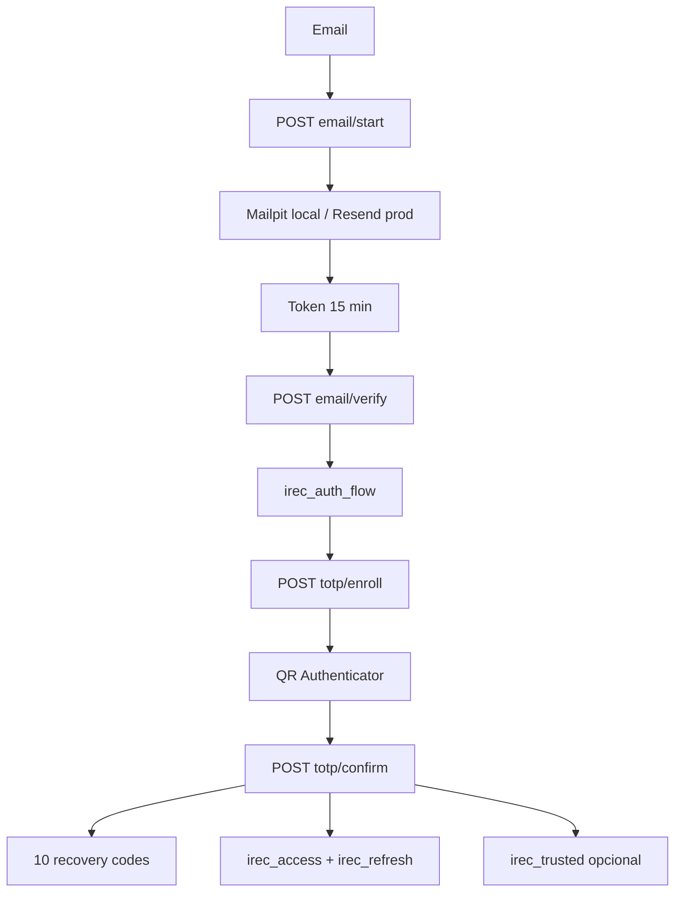

# Identity v0.2.0

## Estado

**Backend: validado.**  
**Frontend/E2E: pendientes.**

## Objetivo

Eliminar contraseña tradicional y usar:

```text
email verificado + TOTP
```

sin guardar secretos de autenticación en almacenamiento web accesible a JS.

## Flujo de alta



## Persistencia PostgreSQL

```text
users
email_tokens
totp_credentials
recovery_codes
trusted_devices
```

## Estado Redis

```text
irec:refresh:<hash>
irec:refresh-used:<hash>
irec:refresh-family:<familyId>
irec:access-revoked:<jti>
irec:auth-flow:<hash>
rate-limit state
```

## Access JWT

- RS256;
- 15 min;
- issuer `irec`;
- audience `irec-web`;
- subject user id;
- `jti`;
- cookie HttpOnly.

## Refresh

- opaco;
- alta entropía;
- 12 h en configuración local actual;
- hash SHA-256 para lookup;
- rota en cada uso;
- token usado deja marker temporal;
- reuso revoca la familia.

## TOTP

- SHA-1;
- 6 dígitos;
- 30 s;
- tolerancia ±1;
- `lastTimeStep` evita replay;
- secreto cifrado AES-256-GCM.

## Recovery codes

- 10;
- mostrados una vez;
- un solo uso;
- bcrypt cost 12.

## Trusted devices

- separados de refresh;
- hasta 30 días;
- revocables;
- sin fingerprinting invasivo.

## Correo

- Mailpit local;
- Resend producción;
- adapter desacoplado;
- anti-enumeración.

## Validación real

El backend pasó:

- DB diagnostics;
- TypeScript;
- OpenAPI;
- builds;
- migraciones;
- smoke checks.
