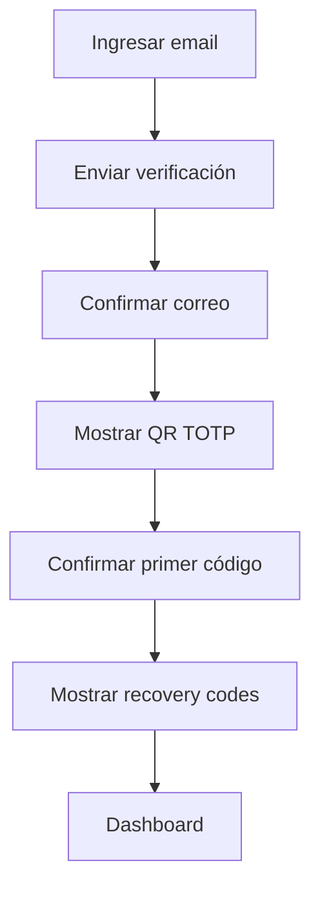
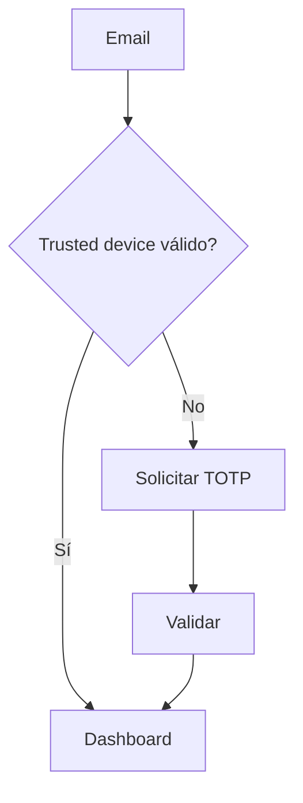
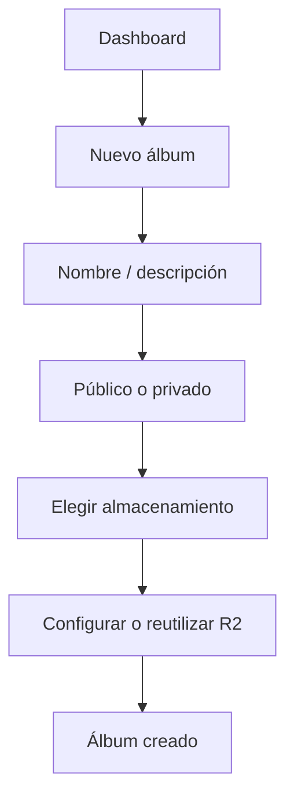
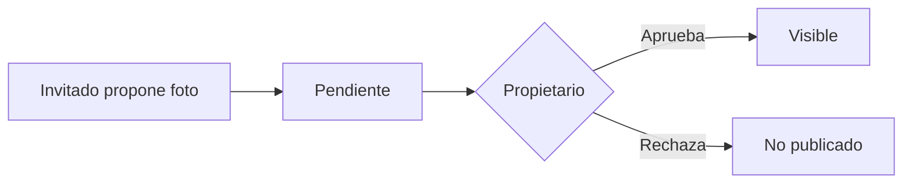

# Flujos de usuario

## Registro

## Login

## Crear álbum

## Propuesta de contenido

## Generación IA

1. Usuario selecciona fotos.
2. Puede indicar una intención estética opcional.
3. IA analiza contenido permitido.
4. Propone clasificación, portada, orden y ThemeManifest.
5. Backend valida el ThemeManifest.
6. Usuario previsualiza.
7. Usuario acepta o regenera.
