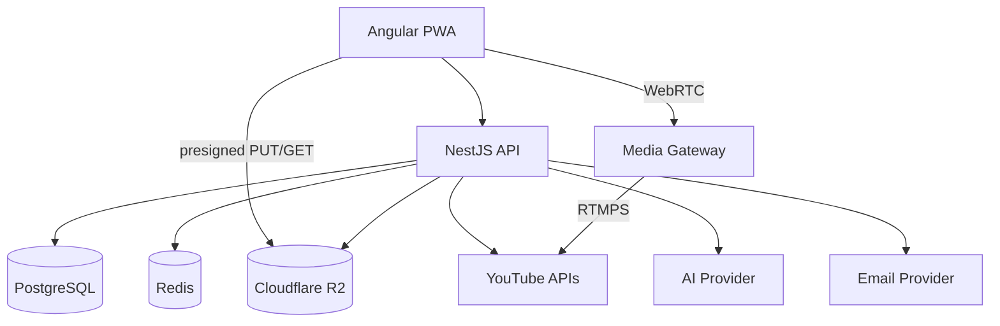

# Arquitectura técnica

## Stack propuesto

### Frontend
- Angular.
- TypeScript.
- Angular PWA / Service Worker.
- Zod para tipos/validación de contratos compartidos donde sea conveniente.
- CSS variables / design tokens.
- reproductor/embeds YouTube.

### Backend
- NestJS.
- TypeScript.
- PostgreSQL.
- Redis para rate limiting, sesiones auxiliares y locks.
- Zod 4.
- `zod-openapi`.
- Scalar API Reference.
- AWS SDK v3 para API S3 compatible de R2.
- Google APIs para YouTube.
- proveedor de email transaccional desacoplado.

### Media
- Cloudflare R2: fotos, thumbnails, assets de tema.
- YouTube: videos, live y grabaciones post-live.
- MediaMTX/FFmpeg: gateway WebRTC -> RTMPS para live desde navegador.

## Diagrama



## Monorepo previsto

```text
iRec/
├─ apps/
│  ├─ web/
│  └─ api/
├─ packages/
│  ├─ contracts/
│  ├─ config/
│  └─ ui/
├─ infra/
├─ docs/
└─ pnpm-workspace.yaml
```

## Límites

- `apps/web` nunca recibe secretos R2.
- `packages/contracts` contiene schemas compartidos sin lógica de infraestructura.
- el documento OpenAPI se genera desde schemas y rutas declaradas en backend.
- Scalar consume `/openapi.json`; no mantiene una segunda especificación manual.
